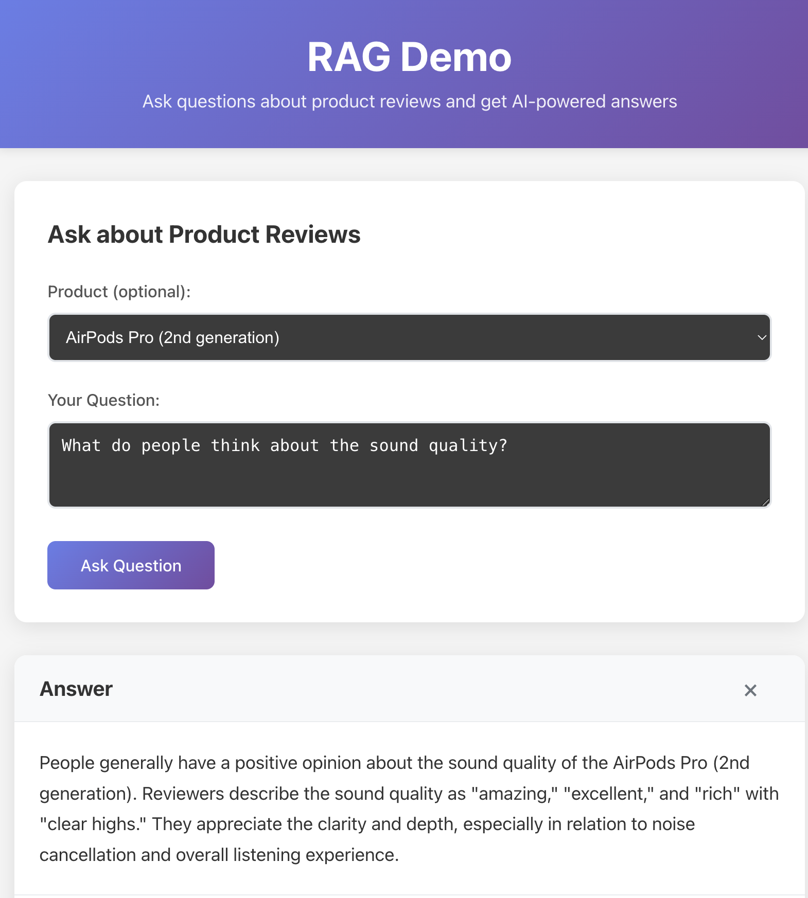

# RAG Demo Application

A complete Retrieval-Augmented Generation (RAG) demonstration built with Ruby/Sinatra backend and React frontend, showcasing how AI can provide intelligent answers based on customer review data.



## Overview

This application demonstrates the RAG (Retrieval-Augmented Generation) architecture pattern, where user questions are answered by:

1. **Retrieving** relevant information from a vector database
2. **Augmenting** the user's query with contextual data
3. **Generating** intelligent responses using a large language model

## How It Works

### 1. Sample Data & Vector Embeddings

The application uses realistic sample data for 3 Apple products:
- **MacBook Pro 16-inch** (5 customer reviews)
- **iPhone 15 Pro** (4 customer reviews)
- **AirPods Pro 2nd Gen** (5 customer reviews)

During the **backfill process**:
- Sample product and review data is inserted into PostgreSQL
- Each review's text content is converted to vector embeddings using OpenAI's `text-embedding-3-small` model
- These 1536-dimensional vectors are stored in PostgreSQL using the pgvector extension

### 2. RAG Pipeline (Server)

When a user asks a question:

1. **Question Embedding**: The user's question is converted to a vector embedding using OpenAI
2. **Vector Similarity Search**: PostgreSQL with pgvector finds the most similar review embeddings using cosine similarity
3. **Context Building**: The top 5 most relevant reviews are retrieved and formatted as context
4. **LLM Generation**: The context and question are sent to OpenAI's `gpt-4o-mini` model to generate a comprehensive answer
5. **Response**: The AI-generated answer is returned along with source review citations

### 3. Frontend Experience

The React frontend provides:
- **Product Selection**: Optional dropdown to filter by specific products
- **Question Input**: Textarea for natural language questions
- **Real-time Results**: AI-powered answers with loading states
- **Source Attribution**: Display of original customer reviews that informed the answer
- **Responsive Design**: Clean, modern UI with Redux state management

## Architecture

```
┌─────────────────┐    ┌──────────────────┐    ┌─────────────────┐
│   React Client  │───▶│  Sinatra Server  │───▶│   PostgreSQL    │
│   (Port 5173)   │    │   (Port 4567)    │    │   + pgvector    │
│                 │    │                  │    │                 │
│ • Redux Store   │    │ • CORS Support   │    │ • Vector Search │
│ • TypeScript    │    │ • RAG Pipeline   │    │ • Sample Data   │
│ • Modern UI     │    │ • OpenAI API     │    │ • Embeddings    │
└─────────────────┘    └──────────────────┘    └─────────────────┘
```

## Getting Started

### Prerequisites
- Ruby 3.1+
- Node.js 18+
- Docker & Docker Compose
- OpenAI API key

### Backend Setup

1. Navigate to server directory:
   ```bash
   cd server
   ```

2. Copy environment variables:
   ```bash
   cp .env.example .env
   ```

3. Add your OpenAI API key to `.env`

4. Start PostgreSQL with Docker:
   ```bash
   docker compose up -d
   ```

5. Install dependencies:
   ```bash
   bundle install
   ```

6. Run database migrations:
   ```bash
   bundle exec ruby scripts/migrate.rb
   ```

7. Backfill sample data and embeddings:
   ```bash
   bundle exec ruby scripts/backfill.rb
   ```

8. Start the server:
   ```bash
   bundle exec ruby app.rb
   ```

### Frontend Setup

1. Navigate to client directory:
   ```bash
   cd client
   ```

2. Install dependencies:
   ```bash
   npm install
   ```

3. Start the development server:
   ```bash
   npm run dev
   ```

4. Open http://localhost:5173

## Example Usage

Ask natural language questions about the products:

- *"What do customers think about the battery life?"*
- *"How is the camera quality on the iPhone?"*
- *"Which product has the best noise cancellation?"*
- *"Are there any issues with the MacBook Pro?"*

The system will find relevant customer reviews and provide AI-generated summaries with source citations.

## Technologies Used

### Backend
- **Ruby/Sinatra** - Lightweight web framework
- **PostgreSQL** - Primary database with pgvector extension
- **pgvector** - Vector similarity search capabilities
- **OpenAI API** - Embeddings (`text-embedding-3-small`) and chat completion (`gpt-4o-mini`)
- **Docker** - PostgreSQL containerization

### Frontend
- **React 18** - Modern UI library
- **TypeScript** - Type safety and developer experience
- **Redux Toolkit** - State management and async operations
- **Vite** - Fast development and build tooling

## Key Features

- **Semantic Search**: Find relevant reviews based on meaning, not just keywords
- **Source Attribution**: Every answer shows which customer reviews were used
- **Real-time Processing**: Fast vector similarity search and AI generation
- **Responsive Design**: Works on desktop and mobile devices
- **Type Safety**: Full TypeScript support throughout the stack
