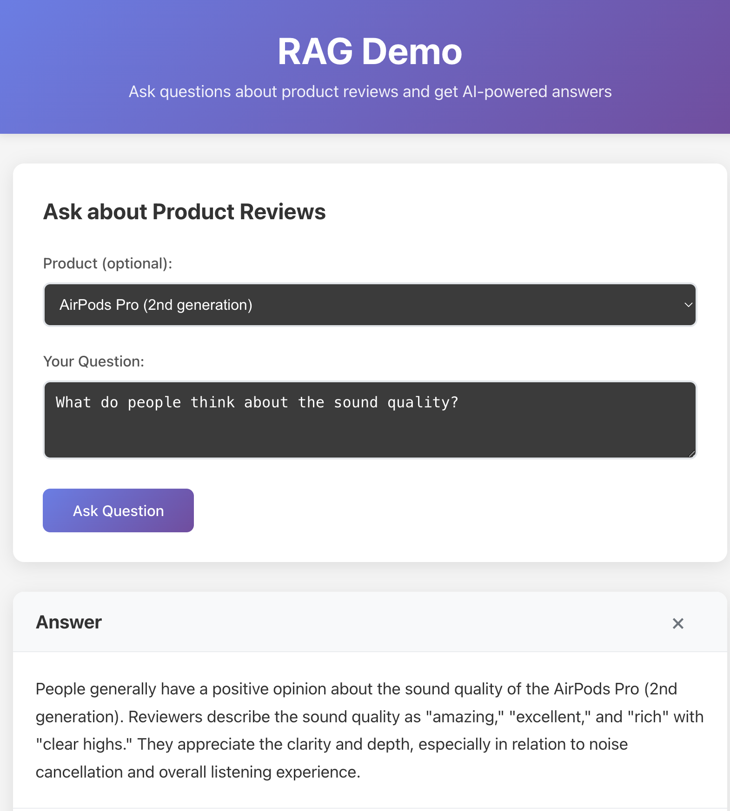

# RAG Demo Client

React frontend for the RAG Demo application with Redux state management and TypeScript.



## Setup

1. Install dependencies:
   ```bash
   npm install
   ```

2. Start the development server:
   ```bash
   npm run dev
   ```

3. Open your browser to http://localhost:5173

## Usage

- Select a product from the dropdown (optional)
- Enter your question about product reviews
- Click "Ask Question" to get AI-powered answers
- View the response with source citations from actual customer reviews

## Requirements

- Node.js 18+
- The RAG Demo backend server running on http://localhost:4567

## Features

- Built with React + TypeScript + Vite
- Redux Toolkit for state management
- Responsive design with modern UI
- Real-time communication with Ruby/Sinatra backend
- Source attribution showing original customer reviews